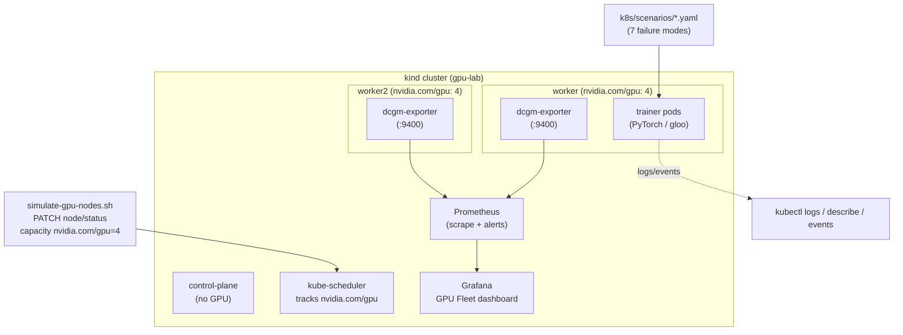

# Architecture — GPU Platform Failure Investigation Lab

## Goal
A self-contained, GPU-free lab that reproduces the failure modes of a real
distributed-training GPU platform on Kubernetes, with full observability and
incident-response playbooks — runnable on a laptop in minutes.

## Key design decision: simulate GPUs *honestly*
We have no physical GPU, but we want the **Kubernetes control plane to behave like
a real GPU cluster**. So we don't fake the scheduler — we feed it real data:

- **GPU capacity** is advertised on worker nodes via Kubernetes' built-in
  [node-level extended resources](https://kubernetes.io/docs/tasks/administer-cluster/extended-resource-node/)
  API (a `PATCH` to the node `/status` subresource). The scheduler then tracks
  `nvidia.com/gpu` requests/limits, and **GPU-exhaustion `Pending` is a genuine
  scheduler decision** — not a mock.
- **Workloads** run CPU PyTorch (`gloo` backend) but report as GPU jobs and emit
  CUDA/NCCL-shaped logs, so every log/metric/RCA workflow is identical to a real
  cluster at the observability layer.
- **GPU metrics** come from a fake `dcgm-exporter` DaemonSet that exposes the real
  `DCGM_FI_DEV_*` metric names with correlated values that move with each scenario.

What's real: K8s scheduling, events, pod lifecycle, exit codes, restart/backoff,
PVC binding, Prometheus scraping, Grafana, alerting. What's simulated: the GPU
hardware itself and the precise contents of failure logs.

## Components
| Path | Role |
|---|---|
| `src/train.py` | Distributed trainer with `FAILURE_MODE` injector |
| `src/gpu_metrics_exporter.py` | Fake DCGM exporter (`DCGM_FI_DEV_*`) |
| `docker/Dockerfile.trainer` | CPU-torch trainer image |
| `k8s/kind-cluster.yaml` | 1 control-plane + 2 workers |
| `scripts/simulate-gpu-nodes.sh` | Advertise fake `nvidia.com/gpu` on workers |
| `k8s/monitoring/` | dcgm-exporter DS + Prometheus + Grafana |
| `k8s/scenarios/` | 7 failure scenarios |
| `scripts/investigate.sh` | One-shot triage bundle for a pod |
| `docs/playbooks/` | Per-failure incident playbooks |
| `investigations/` | Worked RCA postmortems |

## Failure scenario matrix
| # | Scenario | K8s symptom | Layer | Playbook |
|---|---|---|---|---|
| 01 | CUDA OOM | Job Error / CrashLoop | application/GPU mem | 01 |
| 02 | NCCL timeout | Error after hang | distributed comms | 02 |
| 03 | CrashLoopBackOff | restarts climbing | container lifecycle | 03 |
| 04 | Image pull | ImagePullBackOff | registry/image | 04 |
| 05 | GPU scheduling | Pending/FailedScheduling | scheduler/capacity | 05 |
| 06 | PVC mount | ContainerCreating/FailedMount | storage | 06 |
| 07 | Training hang | Running, 0% util | distributed deadlock | 07 |

## 1-Day vs Production
| Concern | 1-Day (this lab) | Production |
|---|---|---|
| GPUs | Extended-resource PATCH, CPU torch | Real GPUs + NVIDIA device plugin |
| Backend | gloo | NCCL over NVLink/IB |
| Metrics | fake dcgm-exporter | nvidia/dcgm-exporter DaemonSet |
| Multi-rank launch | Indexed Job | torchrun + JobSet/operator + gang scheduler |
| Alerting | Prometheus rules | + Alertmanager → PagerDuty |
| Logs | kubectl logs | Loki/ELK with rank correlation |
